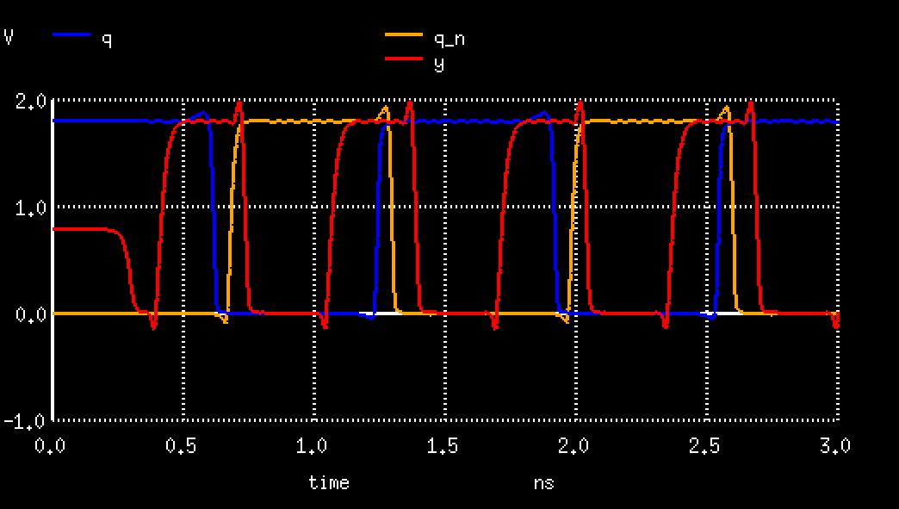

  

# Ring Oscillator with Counter

A ring oscillator with a 64-bit counter that counts the number of oscillations. The counter is connected to pins `ou_out`,
and is shifted by the `cnt_shift` input. The counter is reset when `cnt_reset` is high, and stops when `cnt_stop` is high.

The graph above shows the results of the [spice simulation](src/osc.spice). `y` is the ring oscillator's output, and `q` / `q_n` are the outputs of the DFF that is the least significant bit of the counter.

## What is Tiny Tapeout?

TinyTapeout is an educational project that aims to make it easier and cheaper than ever to get your digital designs manufactured on a real chip.

To learn more and get started, visit https://tinytapeout.com.

## Resources

- [Tiny Tapeout FAQ](https://tinytapeout.com/faq/)
- [Digital design lessons](https://tinytapeout.com/digital_design/)
- [Learn how semiconductors work](https://tinytapeout.com/siliwiz/)
- [Join the community](https://discord.gg/rPK2nSjxy8)
